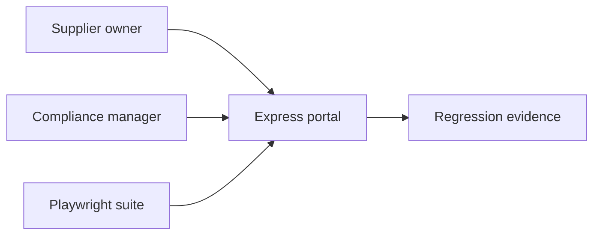
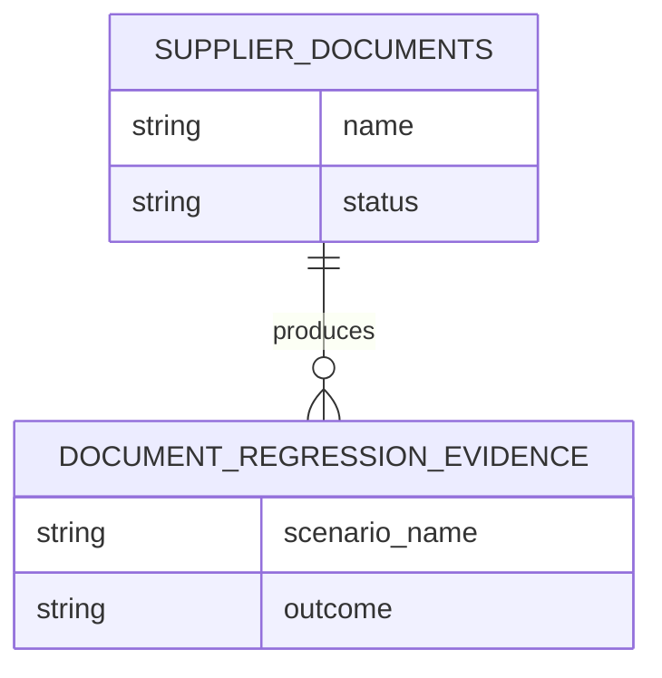
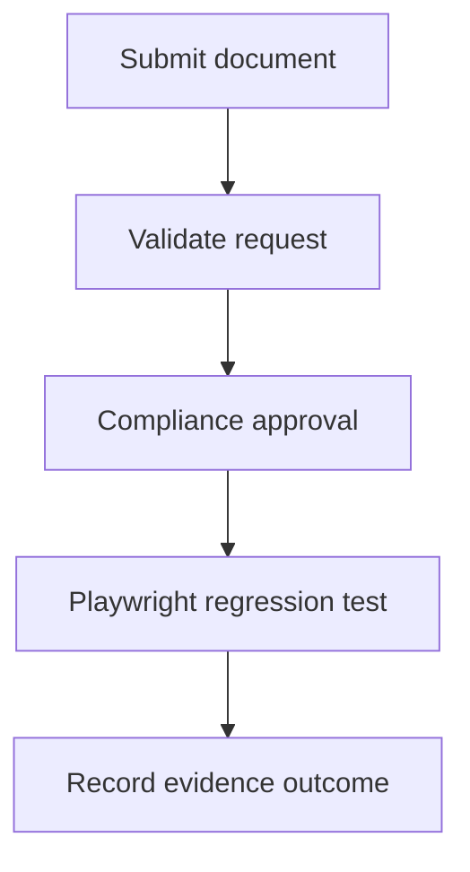
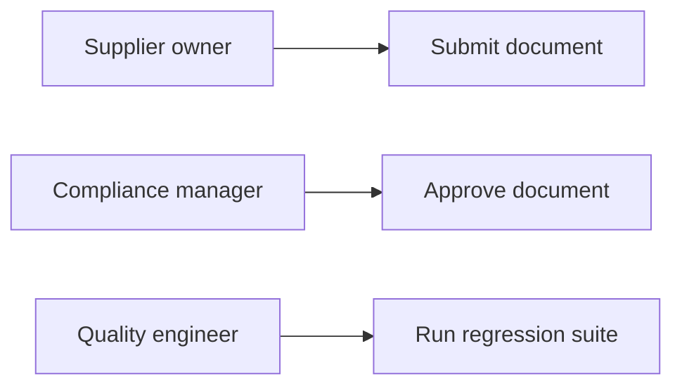
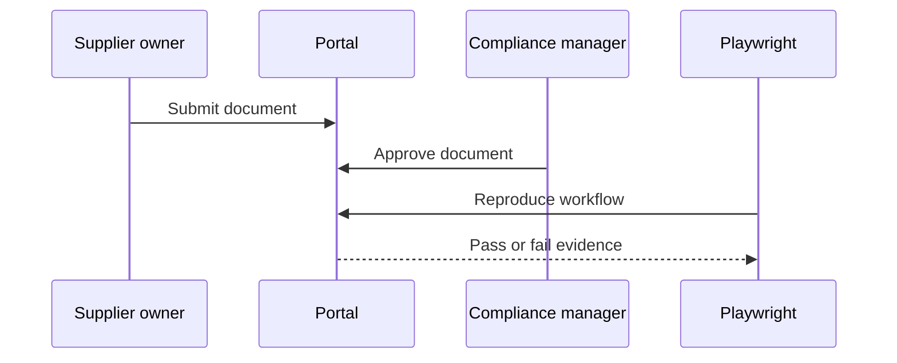

# Playwright Supplier Portal Regression Evidence Platform

## The Problem

Supplier portal changes can silently break document submission or allow an approval control to be bypassed. Manual browser testing is inconsistent, and a defect without reproducible evidence creates avoidable compliance risk.

## The Solution

This project provides a compact supplier document portal with role-separated submission and approval routes, then validates the critical browser and API flows with Playwright. Regression cases capture successful, authorization, validation, not found, and lifecycle behavior as executable evidence.

## Live Demo & Tech Stack

Run the local Node service and call `GET /health`. The stack uses Node 22, Express 5, Playwright 1.62, Chromium browser automation, GitHub Actions, and portable SQL migrations. The service binds to `0.0.0.0` on port 14100.

| Concern | Implementation |
| --- | --- |
| Portal | Supplier document submission and compliance approval endpoints |
| Regression evidence | Playwright page and API workflows |
| Authorization | Supplier owner and compliance manager role boundaries |
| Failure coverage | Validation, forbidden, not found, and state conflict checks |

## Local Setup & Run Instructions

```bash
git clone https://github.com/kholipha-ahmmad-al-amin/playwright-supplier-portal-regression-evidence-platform.git
cd playwright-supplier-portal-regression-evidence-platform
npm ci
npx playwright install chromium
npx playwright test
PORT=14100 node server.js
```

## System Documentation (Mermaid.js)
### Architecture

### ERD

### Data Flow

### Use Case

### Sequence


## Owner
Created and maintained by Kholipha Ahmmad Al-Amin.
Software Engineer and AI Specialist
Founder and CEO of EquiSaaS BD
Principal Consultant at AR IT Consultancy
Full Stack Developer and SaaS Product Builder
### Official links
Portfolio: https://kholipha-ahmmad-al-amin.equisaas-bd.com/
GitHub: https://github.com/kholipha-ahmmad-al-amin
LinkedIn: https://www.linkedin.com/in/kholipha-ahmmad-al-amin
X: https://x.com/al_amin5519
Facebook: https://www.facebook.com/kholipha.ahmmad.al.amin
Instagram: https://www.instagram.com/kholipha.ahmmad.al.amin
## Ownership
This project was created and is maintained by Kholipha Ahmmad Al-Amin.
